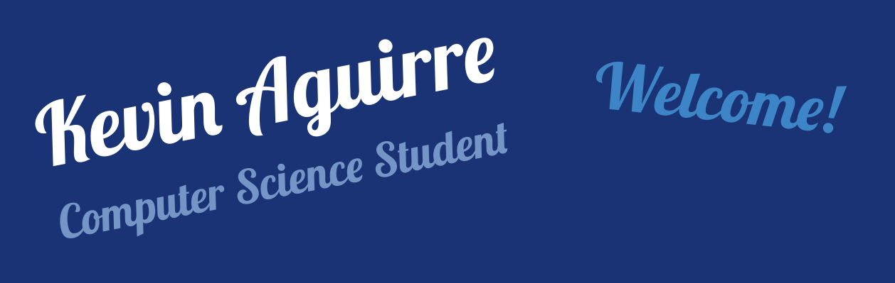

# Hey!

## About Me
Hi! My name is Kevin Aguirre. I'm currently a Junior at New York University, Tandon School of Engineering studying Computer Science. I'm passionate about Software Development, Data Science, and Cybersecurity. I'm currently looking for Software Development internships for Fall 2024, Spring 2025, and Summer 2025. On my spare time, I like to work on personal projects, do calisthenics, make Arduino circuits, and play video games.

## Languages & Technologies 

  
  
  
  
  
  
  
  
  
  
    
  
  

## How to Reach Me 
Feel free to reach out!
E-Mail: kaa9659@nyu.edu 
LinkedIn: https://www.linkedin.com/in/kevin-a-aguirre/
<!--
**Kevin-Aguirre/Kevin-Aguirre** is a ✨ _special_ ✨ repository because its `README.md` (this file) appears on your GitHub profile.

Here are some ideas to get you started:

- 🔭 I’m currently working on ...
- 🌱 I’m currently learning ...
- 👯 I’m looking to collaborate on ...
- 🤔 I’m looking for help with ...
- 💬 Ask me about ...
- 📫 How to reach me: ...
- 😄 Pronouns: ...
- ⚡ Fun fact: ...
-->

